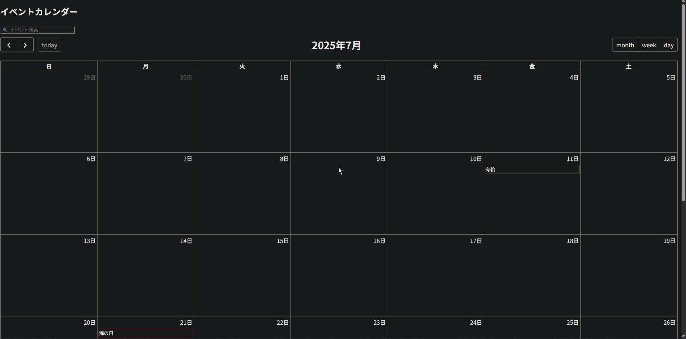

# イベントカレンダーアプリ

## 🚀概要
このアプリは**イベント管理ができるカレンダーアプリ**です。
FullCalendarを使い、直感的にイベント操作が可能です。

##🎥デモ


## 🔧 セットアップ方法

このアプリはローカルのHTMLファイルをブラウザで開くだけで動作します。

### ✅ 方法①（簡易）

1. このリポジトリをクローン
2. `index.html` をブラウザで直接開く（ダブルクリック or 右クリック→「ブラウザで開く」）

### 💡 方法②（推奨：Live Server）

VSCodeを使っている場合、拡張機能「Live Server」を使用すると、以下のように自動リロード付きで快適に開発できます。

1. VSCodeの拡張機能から「Live Server」をインストール  
2. `index.html` を右クリック → 「Open with Live Server」

※ `file://` で読み込むと、ブラウザのセキュリティ制約で動かない処理がある場合に備えて、Live Serverを使うのがおすすめです。


---

```markdown
## ✨ 主な機能

- 📅 カレンダーでのイベント表示
- 🖊 モーダルからイベント追加・削除
- 🔍 イベント検索機能
- 🎌 日本の祝日自動表示
- 💾 ローカルストレージ保存対応
```


## 🛠 技術スタック

| フロントエンド | データ管理   | UIライブラリ     |
|----------------|--------------|------------------|
| HTML/CSS       | LocalStorage | FullCalendar.js |
